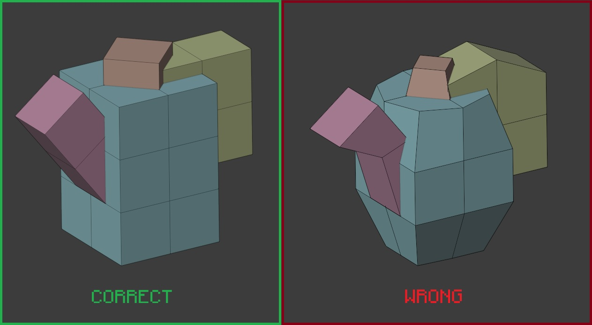
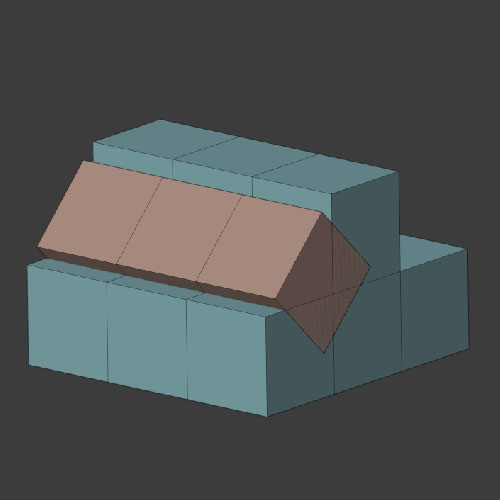
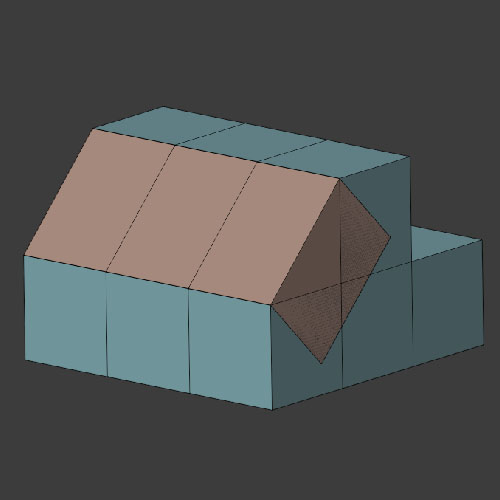
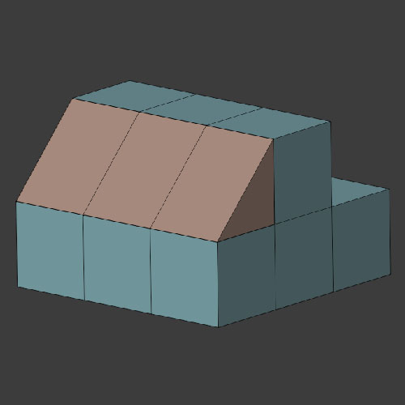
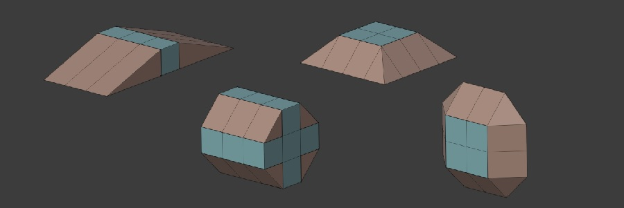
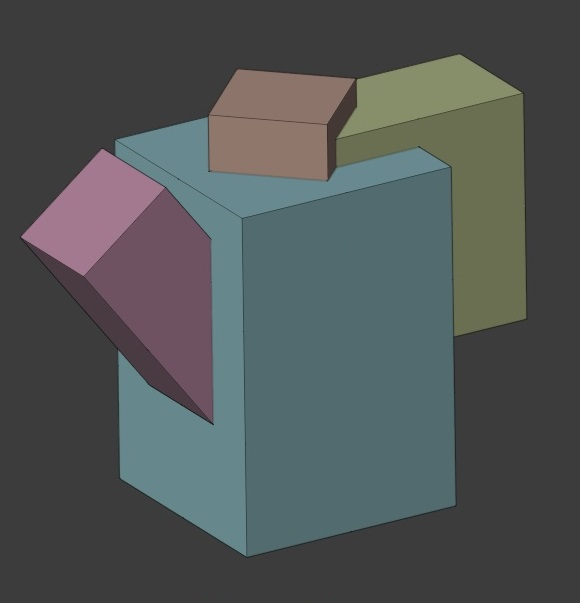

[< Назад к Содержанию](../Texel-Modeling-2.0-RU.md)
# 3. Принципы моделинга в текселе

_Что же за принципы оптимизации применяются в тексельном стиле?_

Строго эти принципы нигде не описаны и не регламентированы, однако исходя из личного опыта можно сформировать следующие принципы, применяемые чаще всего.

- ### Принцип Инкрементной модификации
    В таких программах как Blender есть возможность задать _инкремент модификации_ и впоследствии использовать его во многих инструментах. Инкремент - это единичный размер шага с которым происходит то или иное действие. Этот принцип заключается в использовании только тех инструментов, у которых есть возможность использования этого инкремента.

    К примеру такие инструменты как _Move_ и _Extrude_ можно применять с определенным шагом перемещения / экструдирования. Инструменты _Knife_ и _Bevel_ в свою же очередь при стандартном их применении не позволяют использовать определенный шаг. Однако, инструменты _Rotate_ и _Scale_ тоже не инкрементены, но для их использования нужно пользоваться панелью настроек с указанием нужных параметров.
    - Rotate - градус поворота (желательно целый)
    - Scale - калькуляция множителя (куб 2х2х2 текселя * 0.5 = куб 1х1х1 тексель)
  
>[!NOTE]
> Таким образом, инструментарий можно поделить на следующие категории:
> - Применимый (поддержка инкремента)
> - Применимый в частном случае (при расчете / подборе параметров)
> - Неприменимый (нет поддержки инкремента, возможен результат с плавающей точкой)

- ### Принцип Планирования развертки
    Каждый раз создавая новый объект или его часть необходимо заранее продумывать его развертку. Необходимо знать наперед на какое количество текселей и как именно будет развернут Ваш объект.
    
    Важно понимать, что развертка происходит с **жесткой привязкой** вершыны текселя к углам пикселя текстуры. Это означает, что если 1 тексель меньше пикселя текстуры - это нужно увеличить на развертке, если больше - уменьшить. 
> [!NOTE]
> Однако это правило работает только с единично взятым текселем! 
> **Один тексель должен быть развернут на один пиксель**
- ### Принцип Свободной трансформации
    Используя свободную трансформацию можно сдвигать и вращать отдельные объекты модели как угодно, однако это не применимо к сетке уже готового объекта. 
> [!NOTE]
> Таким образом свободной трансформации подвержены **только отдельно взятые объекты**, выстроенные по сетке, а не его вершины, ребра или полигоны.
    
  
- ### Принцип Углов
    Отходя от Воксельного стиля у нас может возникнуть потребность создать косую плоскость, которую ввиду ограничений мы не в состоянии передать в Воксельном стиле. Поскольку нам доступен обширный набор инструментов, самое простое что мы можем сделать - это **задать вокселям угол**. Далее раз мы получили нужную форму, то попробуем ее максимально **оптимизировать**.
    
    
    
    
    
    По итогу мы получаем инородную для воксельного стиля форму - **треугольник**. Однако, поскольку мы поменяли оригинальную форму текселя - квадрат, то 1 пиксель полностью не поместиться на боковой стороне этого треугольника, также и на лицевой стороне уже не получится его разместить, поскольку эта сторона получилась в итоге чуть длинее. К сожалению с помощью оптимизации лучшего результата добиться сложно, поэтому можно считать такие ситуации за **компромисс** и часть тексельного стиля. 
    
    Таким образом, мы можем использовать углы для создания более сложных и сглаженных форм. 
    
    
- ### Принцип Оптимизации сетки
    Учитывая то, что каждый тексель должнен быть развернут на свой пискель можно подумать что и сетка всех объектов должна состоять из мелких квадратиков, не так ли? Да, Вы можете выстраивать свою модель строго по квадратикам как в Вокселе и разворачивать каждый из них на свой пиксель, но в таком случае это будет не сильно удобно и к тому же могут начаться проблемы с производительностью. Если плоскость плоскость объекта размером 2х3 текселя, то почему бы и не развернуть ее на 2х3 пикселя? 

    Есстесственно, зная точные размеры граней, можно построить более удобную сетку. 
> [!NOTE]
> Таким образом, можно изначально создавать объекты с более оптимальной сеткой.
    
  

[< Назад. Что такое Тексель?](what_is_texel.md) | [Далее. Видеоуроки и материалы >](basic_tutorials.md)
